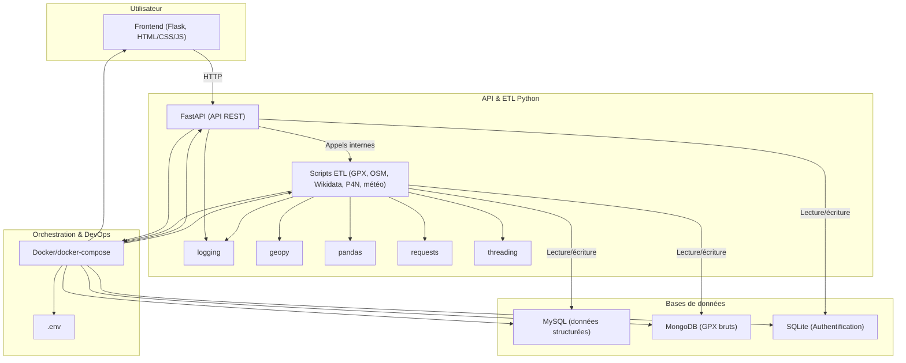

# RandoVango

Application de planification de randonnées en Bretagne avec recherche de spots, météo et points d'intérêt.

## Architecture (2025)

- **Backend Python** :
    - FastAPI pour l’API REST (gestion des villes, randonnées, plans, utilisateurs, authentification JWT)
    - Scripts ETL pour l’extraction, la transformation et le chargement des données multi-sources (GPX, météo, OSM, Wikidata, P4N)
    - MySQL pour les données structurées (villes, randonnées, utilisateurs, plans, météo)
    - MongoDB pour les traces GPX brutes et données non structurées
- **Frontend** :
    - Flask pour le serveur web, rendu des pages avec Jinja2
    - HTML/CSS/JS pour l’interface utilisateur interactive
- **Orchestration & DevOps** :
    - Docker pour la conteneurisation, orchestration via docker-compose
    - Logging centralisé, gestion des variables d’environnement
- **Sécurité** :
    - Authentification JWT, gestion des rôles (SQLite), audit des accès

### Schéma simplifié



## Prérequis

### Environnement Docker (recommandé)

- Docker
- Docker Compose

Toutes les dépendances (Python, Chromium, MySQL, MongoDB) sont gérées automatiquement dans les conteneurs.

### Environnement local (développement)

#### Python et dépendances
```bash
python 3.12+
pip install -r requirements.txt
```

#### Chromium et chromedriver (pour le scraping P4N)

**Sur Ubuntu :**
```bash
sudo apt-get update
sudo apt-get install -y chromium chromium-driver
```
**Configuration du script Python (`backend/etl/extract/scraper_p4n.py`) :**
Adapter les chemins selon votre installation locale :
```python
CHROME_BINARY_PATH = '/usr/bin/chromium'  
CHROMEDRIVER_PATH = '/usr/bin/chromedriver'
```

> **Note :** Si vous utilisez Docker, Chromium et Chromedriver sont installés automatiquement dans les conteneurs. L'installation manuelle n'est requise que pour un usage local hors Docker.

#### Bases de données
- MySQL 8.0+
- MongoDB 6.0+

## Installation et lancement

### Avec Docker (recommandé)

1. **Clone le projet**
```bash
git clone <repo-url>
cd randovango
```

2. **Configure les variables d'environnement**
Copie et adapte le fichier `.env` :
```bash
cp .env.example .env
# Édite .env avec vos paramètres
```

3. **Lance les services**
```bash
docker compose up -d
```
### Lancement manuel des ETL (hors interface frontend)

- **ETL principal (intégration GPX, météo, OSM, Wikidata, P4N), integrer un ou des fichiers GPX dnas le dossier Data**
```bash
docker compose exec backend python3 -m etl.etl_pipeline
```
- **ETL de rattrapage sur OSM,P4N,Wiki (pour relancer l'intégration sur des données déjà présentes)**
```bash
docker compose exec backend python3 -m etl.etl_rattrapage
```
- **ETL meteo pour rafraichir les données**
```bash
docker compose exec backend python3 -m etl.etl_meteo
```

> ⚠️ Le lancement manuel des ETL est réservé aux cas où vous ne passez pas par le frontend Flask. Sinon, toutes les opérations d'intégration de données se font via l'interface utilisateur.

### En local

1. **Installe les dépendances**
```bash
python -m venv .venv
source .venv/bin/activate
pip install -r requirements.txt
```

2. **Configure `.env`** avec les informations de connexion MySQL et MongoDB locales

3. **Lance le backend FastAPI**
```bash
cd backend
uvicorn main:app --reload
```

4. **Lance le frontend Flask**
```bash
cd frontend
python app.py
```

## Utilisation

### Backend API (FastAPI)
- URL : `http://localhost:8000`
- Documentation interactive : `http://localhost:8000/docs`

### Frontend (Flask)
- URL : `http://localhost:5000`

### Adminer (interface MySQL)
- URL : `http://localhost:8080`
- Serveur : `db_randovango`
- Utilisateur : `randovango_user` (voir `.env`)

## Structure du projet

```
randovango/
├── backend/
│   ├── api/              # Routers FastAPI
│   ├── etl/              # Extract, Transform, Load
│   │   ├── extract/      # Scrapers et API externes
│   │   ├── transform/    # Transformation des données
│   │   └── load/         # Chargement en base
│   ├── db_init/          # Scripts d'initialisation DB
│   ├── utils/            # Utilitaires (logger, DB, geo)
│   └── main.py           # Point d'entrée FastAPI
├── frontend/
│   ├── static/           # CSS, JS, images
│   ├── templates/        # Templates Jinja2
│   └── app.py            # Point d'entrée Flask
├── data/
│   ├── in/               # Données d'entrée (GPX, JSON, CSV)
│   └── archive/          # Données archivées
├── storage/
│   ├── mysql/            # Volumes persistants MySQL
│   └── mongodb/          # Volumes persistants MongoDB
├── logs/                 # Logs applicatifs
├── docker-compose.yml
├── Dockerfile.backend
├── Dockerfile.frontend
├── requirements.txt
└── .env
```

## ETL Pipeline

Le pipeline ETL extrait, transforme et charge les données depuis plusieurs sources :

- **Météo** : API Open-Meteo
- **Points d'intérêt (POI)** : OpenStreetMap (Overpass API), Wikidata
- **Spots camping-car** : P4N (scraping Selenium)
- **Traces GPX** : Fichiers GPX locaux

## Développement

### Logs
Les logs sont générés dans le dossier `logs/` et affichés dans la console.

### Migrations base de données
Les schémas MySQL et MongoDB sont versionnés dans `storage/database_schema.sql` et `storage/mongodb_schema.md`.

## Auteurs

[](https://github.com/natbediee/)  
En formation développeur IA   
ISEN Brest  
