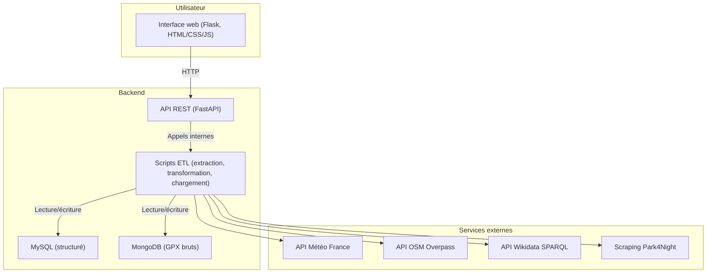

# Présentation Randovango

---

## 1. Titre
**Randovango : plateforme intelligente de planification de randonnées**
- Présenté par : [Votre nom]
- Date : 31 octobre 2025

---

## 2. Problématique
- Aujourd’hui, planifier une randonnée personnalisée demande de croiser de nombreuses sources : traces GPX, météo, points d’intérêt, hébergements, services.
- Les outils existants sont souvent limités, manuels ou peu adaptés à la personnalisation.
- Les randonneurs veulent des parcours adaptés à leur niveau, leurs envies, la météo, et pouvoir tout préparer simplement.

---

## 3. Objectifs du projet
- Centraliser toutes les données utiles à la randonnée (traces, POI, météo, services).
- Automatiser l’enrichissement et la vérification des parcours.
- Générer des plans de randonnée sur-mesure, optimisés selon les critères de l’utilisateur (distance, difficulté, météo, services).
- Proposer une interface simple, moderne et sécurisée.

---

## 4. Architecture technique
- **Backend Python** :
    - FastAPI pour l’API REST (gestion des villes, randonnées, plans, utilisateurs, authentification JWT).
    - Scripts ETL pour l’extraction, la transformation et le chargement des données multi-sources.
    - MySQL pour les données structurées (villes, randonnées, plans, météo).
    - MongoDB pour les traces GPX brutes et données non structurées.
- **Frontend** :
    - Flask pour le serveur web, rendu des pages avec Jinja2.
    - HTML/CSS/JS pour l’interface utilisateur interactive.
- **Orchestration & DevOps** :
    - Docker pour la conteneurisation, orchestration via docker-compose.
    - Logging centralisé, gestion des variables d’environnement.

---

## 4bis. Diagramme d'architecture globale

---

## 5. Pipeline de données
- **Étapes clés** :
    1. Extraction des traces GPX (fichiers ou API externes)
    2. Identification automatique de la ville de départ (géocodage)
    3. Enrichissement par extraction de la météo, des spots Park4Night, des POI OSM, du patrimoine Wikidata
    4. Transformation des données (nettoyage, normalisation, calculs de distance/dénivelé)
    5. Chargement structuré dans MySQL (pour l’API) et MongoDB (pour l’archivage et la recherche avancée)
- **Automatisation** : tout le pipeline est orchestré par le script `etl_pipeline.py`.

---

## 6. Fonctionnalités principales
- Recherche de villes avec statistiques et météo en temps réel
- Liste des randonnées vérifiées pour chaque ville
- Génération de plans de voyage personnalisés (multi-jours, POI, services)
- Authentification sécurisée (JWT, gestion des rôles)
- Téléchargement des traces GPX, visualisation sur carte, export PDF
- Ajout de nouvelles traces GPX par l’utilisateur (avec vérification automatique)

---

## 7. Démo (5-6 min)
- **Recherche d’une ville** : démonstration de la recherche, affichage des statistiques et de la météo
- **Génération d’un plan de randonnée** : choix des critères, visualisation du plan généré (itinéraire, POI, météo)
- **Téléchargement et visualisation** : export GPX, affichage sur carte, accès aux infos pratiques
- **(Optionnel) Ajout d’un GPX** : upload, analyse automatique, intégration dans la base

---

## 8. Stack technique
- **Backend** : FastAPI, gpxpy (analyse GPX), pandas (manipulation de données), requests (API externes), Selenium (scraping Park4Night)
- **Base de données** : MySQL (relations, requêtes complexes), MongoDB (stockage brut, recherche géospatiale)
- **Frontend** : Flask, Jinja2, HTML/CSS/JS, Leaflet.js (cartographie)
- **Sécurité** : JWT, gestion des rôles avec SQLite, audit des accès
- **DevOps** : Docker, docker-compose, logging, .env

---

## 9. Calculs géographiques
- **Formule de Haversine** : calcul de la distance à vol d’oiseau entre deux points GPS (utilisée pour les recherches et la génération d’itinéraires)
- **Distance 3D avec gpxpy** : prise en compte du dénivelé pour la distance réelle parcourue
- **Exemple** : pour chaque segment de trace, la distance est calculée et cumulée pour obtenir la distance totale de la randonnée

---

## 10. Perspectives IA
- **Recommandations personnalisées** : proposer des itinéraires adaptés au profil, à l’historique, à la météo
- **Analyse prédictive météo** : ajuster les plans selon les prévisions et les risques
- **Génération automatique de plans** : IA pour optimiser les étapes, les POI, la difficulté
- **Détection d’anomalies** : contrôle qualité des données importées

---

## 11. Adaptabilité
- Extension possible à d’autres types de voyage itinérant :
    - Bikepacking (vélo), voyage sac à dos, trek multi-jours
    - Ajout de nouvelles sources (OpenCycleMap, hébergements, transports)
    - Critères spécifiques (type de terrain, accessibilité, points d’eau)

---

## 12. Conclusion
- Randovango : une plateforme robuste, évolutive et innovante
- Automatisation complète du traitement des données de randonnée
- Expérience utilisateur enrichie, personnalisée et sécurisée
- Ouverture vers l’IA et de nouveaux usages (autres sports, tourisme)

---

## 13. Questions / Échanges
- Merci pour votre attention !
- Questions, retours, suggestions ?

---

## Validation des compétences RNCP Bloc E1 (C1 à C5)

> **C1 – Analyse du besoin et spécifications**
> - Identification des besoins utilisateurs (centralisation, personnalisation, automatisation)
> - Rédaction des spécifications fonctionnelles et techniques (voir slides 2-3)
>
> **C2 – Conception de l’architecture**
> - Modélisation de l’architecture logicielle (voir diagramme ci-dessus)
> - Choix des technologies adaptées (FastAPI, ETL, MySQL, MongoDB, Docker)
>
> **C3 – Développement logiciel**
> - Réalisation des scripts ETL, API REST, calculs géographiques, gestion des rôles
> - Exemples de code et logique métier présentés lors de la démo
>
> **C4 – Intégration, tests, déploiement**
> - Orchestration du pipeline, conteneurisation Docker, gestion des environnements
> - Automatisation des tests, robustesse et traçabilité
>
> **C5 – Maintenance et évolution**
> - Architecture modulaire, documentation, extensibilité (autres types de voyage, IA)
> - Perspectives d’évolution et adaptation à de nouveaux besoins
